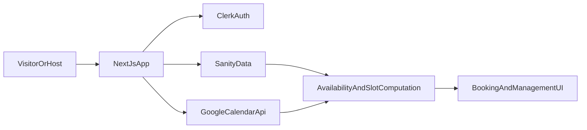

# Slotify

Slotify is a full-stack scheduling platform that helps users share booking links, publish real-time availability, and accept meetings without back-and-forth messaging. It combines secure authentication, Google Calendar sync, timezone-aware slot rendering, and admin insights in one modern web application.

## Features

- Public booking pages by host slug and meeting type.
- Host availability dashboard with calendar-style time block management.
- Google Calendar integration to sync busy slots and prevent double bookings.
- Timezone-aware slot grouping so visitors see correct local date/time.
- Booking management view for hosts to track upcoming meetings.
- Plan-based quotas (free/starter/pro style limits).
- Admin dashboard with insights and feedback management.
- In-app user feedback collection flow.

## Tech Stack

### Frontend
- Next.js (App Router)
- React
- TypeScript
- Tailwind CSS
- shadcn/ui + Radix UI

### Backend and Data
- Clerk (authentication and plan checks)
- Sanity (content/data layer, schemas, GROQ queries)
- Next.js server actions and route handlers

### Integrations
- Google Calendar API (OAuth + calendar availability/event sync)

### Tooling
- Biome (linting/formatting)
- date-fns + date-fns-tz (date and timezone handling)

## Architecture (High-Level)



## Prerequisites

Before running locally, make sure you have:

- Node.js 20+ installed
- npm installed
- A Clerk application (for auth keys)
- A Sanity project and dataset
- A Google Cloud OAuth app (Calendar API enabled)

## Local Setup

### 1) Clone the repository

```bash
git clone https://github.com/PrAnSH-M/scheduling_platform.git
cd scheduling_platform/slotify
```

### 2) Install dependencies

```bash
npm install
```

### 3) Create environment file

Create `.env.local` in `slotify/`:

```bash
touch .env.local
```

Then add these keys to `.env.local`:

```env
# Clerk
NEXT_PUBLIC_CLERK_PUBLISHABLE_KEY=
CLERK_SECRET_KEY=

# Sanity
NEXT_PUBLIC_SANITY_PROJECT_ID=
NEXT_PUBLIC_SANITY_DATASET=
NEXT_PUBLIC_SANITY_API_VERSION=2026-04-17
SANITY_API_TOKEN=

# Google OAuth / Calendar API
GOOGLE_CLIENT_ID=
GOOGLE_CLIENT_SECRET=
GOOGLE_REDIRECT_URI=http://localhost:3000/api/calendar/callback

# App URL
NEXT_PUBLIC_APP_URL=http://localhost:3000
```

### 4) Start the development server

```bash
npm run dev
```

Open [http://localhost:3000](http://localhost:3000) in your browser.

## Available Scripts

Run these commands from `slotify/`:

- `npm run dev` - Start local development server.
- `npm run build` - Create production build.
- `npm run start` - Start production server (after build).
- `npm run lint` - Run Biome checks.
- `npm run format` - Format code with Biome.
- `npm run typegen` - Extract Sanity schema and generate types.

## Key Project Areas

- `slotify/app` - App Router pages and layouts.
- `slotify/components` - UI and feature components.
- `slotify/lib` - Actions, availability logic, integrations.
- `slotify/sanity` - Sanity client, schemas, queries, generated types.

## Troubleshooting

### Missing environment variable errors
- Confirm all required keys are present in `slotify/.env.local`.
- Restart the dev server after updating environment variables.

### Google OAuth redirect mismatch
- Ensure `GOOGLE_REDIRECT_URI` matches your Google Cloud OAuth redirect exactly.
- For local development, use `http://localhost:3000/api/calendar/callback`.

### Clerk auth not working
- Verify publishable/secret keys are from the same Clerk application.
- Confirm allowed localhost URLs are configured in Clerk dashboard.

### Sanity data not loading
- Verify `NEXT_PUBLIC_SANITY_PROJECT_ID` and `NEXT_PUBLIC_SANITY_DATASET`.
- Ensure `SANITY_API_TOKEN` has enough permissions for write operations.

